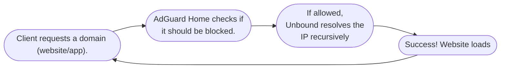

<div align="center">

# 🚀 AdGuard & Tailscale Home Hub 🛡️

[](https://opensource.org/licenses/MIT)
[](https://www.docker.com/)
[](https://www.raspberrypi.org/)
[](https://tailscale.com/)
[](https://adguard.com/)
[](https://nlnetlabs.nl/projects/unbound/about/)

</div>

**Ad blocker, private DNS server, and secure remote access gateway.** This project turns your Raspberry Pi into a central hub that cleans your internet from ads and lets you connect back home securely from any device, anywhere.

<div align="center">

## 🌟 Overview

</div>

I built this project to solve three main problems that standard home routers can't handle:

**Network-Wide Ad Blocking:** Instead of installing ad-blockers on each individual device, AdGuard Home handles it at the source. If it's on your network, it's ad-free. Simple as that.

**Privacy & Tracking:** By default, your ISP (Internet Service Provider) can see every website you visit through their DNS. This stack uses Unbound to bypass ISP resolvers and query root servers directly.

**Secure Remote Access:** When traveling, you often need a secure connection or your home's IP address to access local services. Tailscale creates an encrypted tunnel back to your Pi, acting as your own personal VPN (Exit Node).

### Key Features

**Network-Wide Filtering:** Full control to block ads, apps, websites, trackers, and malware on every device in your home network. <br>
**Recursive DNS:** Use Unbound to resolve queries directly from Root Servers for ultimate privacy.<br>
**Global VPN (Exit Node):** Securely browse the web as if you are sitting in your living room, even when traveling abroad.<br>
**Service Control:** Easily block or limit access to social media (TikTok, Instagram, etc.) and other services via a clean UI.

<div align="center">

## 🏗️ Architecture

</div>

The traffic flows as follows:
<div align="center">
    


</div>

> [!NOTE]
> **Note:** Tailscale provides an encrypted tunnel for remote devices to connect to the home network and use this stack securely from anywhere.

<div align="center">

## 📋 Prerequisites

</div>

Before you begin, ensure you have the following:

- **Hardware:** Raspberry Pi (3B+, 4, or 5 recommended) with 1GB+ RAM.
- **Storage:** 16GB+ MicroSD card.
- **OS:** Raspberry Pi OS Lite (Debian 12) 64-bit.

<div align="center">

## 💻 Installation

</div>

> [!CAUTION]
> **AI Disclosure & Disclaimer:** <br>
>  Parts of the configuration, scripts, and this documentation were developed with the assistance of AI tools. While I have made a **best effort** to review, test, and optimize the code for security, I am not a professional security auditor. 
> 
> Please **use this project with caution**, review the scripts before running them, and understand that you are responsible for the security of your own home network.

<div align="center">

### 🛠️ Step 1: Operating System Setup

</div>

To ensure a lightweight and stable environment, we use **Raspberry Pi OS Lite (64-bit)**. This version lacks a desktop interface, which saves system resources for our Docker services.

#### 1. Download Raspberry Pi Imager

First, download and install the official imaging tool for your operating system:<br>
**Official Website:** [raspberrypi.com/software](https://www.raspberrypi.com/software/)

#### 2. Prepare the MicroSD Card

- Connect your MicroSD card to your computer.

> [!CAUTION]
> **Warning:** Ensure the card is empty or backed up, as the flashing process will **permanently erase** all existing data on the drive.

#### 3. Configure the Imager

Open the Raspberry Pi Imager and follow these steps:

**Device:** Select your model (e.g., Raspberry Pi 5)<br>
**Operating System:** Choose Raspberry Pi OS Lite (64-bit)<br>
**Storage:** Select your MicroSD card from the list<br>
**Customization:**

- **Hostname:** Set a unique name (e.g., `adguard-hub`). This allows you to connect via `<hostname>.local`.
- **User:** Create your primary admin username and password.
- **Wireless LAN:** Configure your WiFi credentials if you are not using a LAN (Ethernet) cable.
- **Localisation:** Set your time zone and keyboard layout (e.g., `America/Chicago`).
- **Remote Access:** You **MUST** check **Enable SSH** and select **Use password authentication**.
- **Raspberry Pi Connect:** Ensure this is set to **OFF** (we will manage the server via SSH and Tailscale).

> [!IMPORTANT]
> **SSH must be enabled.** This is the only way to access the Pi remotely for the subsequent installation steps.

#### 4. Flashing and Initial Boot

Once you have saved your customization settings, click **YES** to start the flashing process.<br>
Wait for the flashing process to finish and for the "Write Successful" confirmation before removing the card. <br>
Insert the MicroSD card into your Raspberry Pi and connect the power supply to begin the initial boot.

#### 5. Connecting to Pi

Now you can connect via **SSH** to your Pi:

```bash
ssh <YOUR_PI_USERNAME>@<YOUR_PI_HOSTNAME OR YOUR_PI_IP_ADDRESS>
```

Enter **yes** and afterward enter your password.

**You are in!**

<br>

<div align="center">

### 🐳 Step 2: Docker Infrastructure

</div>

To run our services in an isolated environment, we need to install Docker and Docker Compose.

#### 1. Update the package list and upgrade all installed packages to their latest versions

```bash
sudo apt update && sudo apt upgrade -y
```

#### 2. Download and run the official Docker installation script

```bash
curl -fsSL https://get.docker.com -o get-docker.sh && sudo sh get-docker.sh
```

#### 3. Add your current user to the Docker group to run containers without using sudo

```bash
sudo usermod -aG docker $USER
```

#### 4. Verify the installation of Docker and Docker Compose

```bash
docker --version && docker compose version
```

<br>

<div align="center">

### 🚀 Step 3: Deploying the Hub

</div>

Now that Docker is ready, we will pull the project files from GitHub to the Raspberry Pi.

#### 1. Clone the Repository

Navigate to your home directory and clone this project:

```bash
cd ~ && git clone https://github.com/natanel5/AdGuard-Tailscale-Home-Hub.git
```

Move into the newly created folder to start managing the services:

```bash
cd AdGuard-Tailscale-Home-Hub
```

#### 2. Start the services

Start the services in detached mode (running in the background):

```bash
sudo docker compose up -d
```

<br>

<div align="center">

### 🛡️ Step 4: Configuring the AdGuard

</div>

We are going to set up our first service, **AdGuard Home!**

#### 1. Getting Started with AdGuard

First, open a browser on your computer and navigate to:

```Plaintext
http://<your-pi-ip>:3000
```

> [!NOTE]
> **Note:** Port 3000 is only used for the initial configuration.<br>
> Once set up, the main dashboard will be accessible via the standard port 80.

Now we can see the AdGuard Home setup!

Click the **Get Started** button and leave the settings as follows:

- **Admin Web Interface**: All interfaces on port 80

- **DNS Server**: All interfaces on port 53

In the next step, choose a username and a password.

> [!IMPORTANT]
> **Important:** Remember these login credentials, as this is your management dashboard.

On the next page, you'll see a guide on connecting your AdGuard to the router;<br>
You can **ignore** it and click **Next** because we'll cover it later.

#### 2. Adding blocklists

Go to **Filters -> DNS Blocklists**<br>
AdGuard includes default lists; ensure they are enabled.

You can add more by selecting **Add blocklist -> Choose from the list.**
I recommend enabling the default lists plus your specific **Regional filters**.<br>
But it's important to do your **own research**.

> [!TIP]
> **Optional:** You can go to **Filters -> Blocked services** for blocking specific apps, websites, or
> online programs from your network.

#### 3. Connecting AdGuard to your Network

To add AdGuard to your home network, we have 3 steps:

#### 4. Enter the router management UI

Navigate to your router's address in the browser.
Usually it's **192.168.1.1**, but sometimes it can be **192.168.0.1** or **10.0.0.1**.
If it's none of the above, you can look at the Network settings on any device connected to the same network and look for the **Default Gateway**; this is your router's IP address.

#### 5. Assigning a Static IP to your Pi

Your router's DHCP server assigns IP addresses dynamically.
Sometimes, if your Pi or your router restarts, the DHCP server might assign a new IP to the Pi.
This would break your network configuration, as the router would still try to forward DNS requests to the old (non-existent) address.

On your router management UI, find a setting called **Static leases** or **Address Reservation** (every UI has different names) and assign a static IP to your Pi based on its **MAC address**. <br>

To find your MAC address on the Pi terminal, run this command:

```bash
cat /sys/class/net/$(ip route show default | awk '/default/ {print $5}')/address
```

The output should follow this format: **00:1a:2b:3c:4d:5e**

> [!IMPORTANT]
> The MAC address depends on your connection type (Wi-Fi or LAN).<br>
> If you switch between them, you will need to update your DHCP reservation with the new MAC address.

#### 6. Forward all your DNS queries to the Pi

For the final part, we need to make sure all the DNS queries route through your AdGuard, located inside your home Pi.

We have 2 choices:

- **Option 1 - Router-Level Setup (Recommended):**<br>
  Find the DNS Server Address setting in your router's dashboard and replace the default DNS with your Pi's static IP. <br>
  This setting is typically found in one of two places:
  - **Internet / WAN Settings:** The router acts as a proxy. It receives queries and forwards them to AdGuard.<br>
    **In AdGuard logs, all traffic will appear as coming from the router's IP **only**.**
    
  - **DHCP Server Settings:** The router informs each device to use the Pi's DNS directly when they connect to the network.<br>
    This is the **preferred method** as it allows AdGuard to identify individual devices. <br>
    **It may require a router restart or for devices to reconnect to pick up the new DNS settings.**

> [!NOTE]
> You can configure both options simultaneously so the WAN setting covers your network until each device picks up the updated DNS server via DHCP.

- **Option 2 - Device-Level Setup:**<br>
  You can go to the **AdGuard management UI** and navigate to the **setup guide** tab, and see the
  instructions on any device.

#### 7. Custom Filtering Rules

Lastly, go to **Filters -> Custom filtering rules** and enter these rules. This is where you can manage your own whitelist or blacklist.

```Plaintext
! Samsung News (Unblock Taboola for Samsung News Feed)
@@||cdn.taboola.com^$important
@@||api.taboola.com^$important
@@||images.taboola.com^$important

! Meta / Instagram (Media & CDN)
@@||fbcdn.net^$important

! Meta General Domains
@@||facebook.net^$important
@@||instagram.net^$important
```

This is the place you can enter your **own** filtering rules.

> [!NOTE]
> This is a curated list based on my personal experience with AdGuard Home, and I will update it periodically.

The fastest way to refine your filtering rules is by using the **Query Log** feature. This allows you to intercept and manage traffic as it happens:

- **Identify:** Search for specific requests. **Blocked** entries appear in **Red**, while **allowed** ones are **Green** (or have no specific highlight).

- **Action:** Click any query to open the details view, then use the button at the bottom of the window to instantly **Block** or **Unblock** it.

- **Targeted Control:** You can apply these rules globally or restrict them to a **specific client**. The option to target a specific user is available right in the query details window (next to the Block/Unblock button), allowing for different policies across your devices (e.g., stricter rules for IoT devices vs. your personal laptop).

#### 8. Additional configurations (Not mandatory)

Go to **Settings -> DNS settings -> DNS Cache Configuration** and adjust the following configurations:

- **Cache size** - Change the number to **67,108,864** (64MB);<br>
  Increasing the cache size reduces recursive lookups and improves overall network latency.

- **Optimistic caching** - Enable this to improve performance;<br>
  This allows AdGuard to serve expired entries from the cache while simultaneously updating them in the background.

<br>

<div align="center">

### 🔗 Step 5: Configuring the Unbound service

</div>

Now we can set our second service, **The Unbound service!**<br>
This service will help us to resolve queries **privately** and **securely**.

#### 1. ICANN DNS Server Setup

The Unbound service can resolve queries with the official **ICANN** DNS servers.<br>
That can give us more privacy as our queries don't go through third parties like your ISP or Google.

To get the ICANN DNS server information, we run this command that takes the info from the **official** site and **restarts** the service:

```bash
wget https://www.internic.net/domain/named.root -qO ~/AdGuard-Tailscale-Home-Hub/unbound/root.hints && docker restart unbound
```

Next, we make a **crontab** that every **6 months** refreshes the **root.hints** file and restart unbound.

```bash
crontab -e
```

Choose the **/bin/nano** and paste the following code at the end of the file:

```bash
0 0 1 */6 * wget https://www.internic.net/domain/named.root -qO ~/AdGuard-Tailscale-Home-Hub/unbound/root.hints && docker restart unbound
```

#### 2. Configuring DNSSEC

Sets up the master security key so Unbound can validate DNS responses using DNSSEC to prevent spoofing.

```bash
docker run --rm -v $(pwd)/unbound:/etc/unbound --entrypoint unbound-anchor klutchell/unbound:latest -a /etc/unbound/root.key
```

To **allow** the Unbound service to write the root.key file we give **read & write** permission to the **root.key** file and **full** permissions to the unbound directory.

```bash
sudo chmod 666 ./unbound/root.key
```

```bash
sudo chmod 777 ./unbound
```

#### 3. Testing the resolver
Now the server is up, and you can check it with the **dig tool**.

Update and download the tool

```bash
sudo apt update && sudo apt install dnsutils -y
```

Now you can check if it's working.

```bash
dig google.com @127.0.0.1 -p 5335
```

If you get **status: NOERROR**, you are good to go.

#### 4. Connecting AdGuard to Unbound

Now the next step is to direct the **AdGuard** to use the **Unbound** service.

Go to the **AdGuard** configuration page, enter the **Settings -> DNS settings -> Upstream DNS servers**, erase all the default DNS servers, and write only **127.0.0.1:5335** so we are redirecting every DNS query to our Unbound service.

Next, we will fail-proof our system so that, if the unbound service is down, we redirect the queries to more reliable servers like Google, Cloudflare, Quad9, etc.

On the same block, go to **Fallback DNS servers** and write one of the following options.

- 1.1.1.1 - Cloudflare DNS for fast, reliable, secure, and private.
- 8.8.8.8 - Google DNS for fast, reliable, and secure.
- 9.9.9.9 - Quad9 DNS for fast, reliable, secure, and even more private.
- any other DNS server you want.

Last go to **Upstream timeout** setting, which allows you to choose how much time it takes for AdGuard to redirect the queries to the **fallback DNS servers**.<br>
The default is 10 seconds, but my recommendation is 3-5 seconds. Choose and press apply.

> [!NOTE]
> You can see that everything works correctly if you press the **Test upstreams** button and get the **Specified DNS servers are working correctly** message.

<br>

<div align="center">

### 🛜 Step 6: Configuring Tailscale service

</div>

The Final service we will configure is the **Tailscale service!**
With this service, we can enable several key features:

- **Private Exit Node:** Transform your Pi into a dedicated **VPN server**. <br>
By routing your traffic through your Pi, your communication leaves from your home network regardless of your actual location.
This ensures a secure and private connection, even when using untrusted public Wi-Fi.

- **Global Ad-Blocking:** Route all DNS queries through the Pi to leverage AdGuard and Unbound protections on the go.<br>
This ensures your DNS traffic is filtered and private, just as it is at home.

- **Subnet Router:** **Securely** access local home devices and services from anywhere in the world **without** exposing them to the public internet.

#### 1. Preparing our network settings

To begin, we need to add a configuration to the file that allows the **system kernel** to forward **IPv4** and **IPv6** traffic between network interfaces:

```bash
echo 'net.ipv4.ip_forward = 1' | sudo tee -a /etc/sysctl.d/99-tailscale.conf
```

```bash
echo 'net.ipv6.conf.all.forwarding = 1' | sudo tee -a /etc/sysctl.d/99-tailscale.conf
```

This command loads and applies the new kernel settings we created in the previous steps into the active system, **without** requiring a **reboot**:

```bash
sudo sysctl -p /etc/sysctl.d/99-tailscale.conf
```

#### 2. Network Performance Optimization

Update the package list and install **ethtool**, which is a utility used to modify low-level network interface settings at the hardware level:

```bash
sudo apt update && sudo apt install ethtool -y
```

Create a system service that configures the **network interface** (eth0) to operate optimally for **VPN** traffic by enabling **rx-udp-gro-forwarding**:

> [!IMPORTANT]
> If you are using a Raspberry Pi 5 or a different OS version, your interface name might be **end0** instead of **eth0**. You can check your interface name by running **ip link** and changing the following commands.


```bash
sudo nano /etc/systemd/system/tailscale-optimize.service
```

```bash
[Unit]
Description=Tailscale Performance Optimization
After=network.target

[Service]
Type=oneshot
ExecStart=/usr/sbin/ethtool -K eth0 rx-udp-gro-forwarding on rx-gro-list off
RemainAfterExit=yes

[Install]
WantedBy=multi-user.target
```

Press **CTRL + S** to save and **CTRL + X** to exit.

Enable the new service to run **immediately** and ensure it starts **automatically** whenever the Pi **reboots**:

```bash
sudo systemctl enable --now tailscale-optimize.service
```

These commands configure **NAT masquerading** and permit **bidirectional packet forwarding** between the Tailscale interface and the internet, **enabling** the Raspberry Pi to function as a **secure Exit Node**:

```bash
sudo iptables -t nat -A POSTROUTING -o eth0 -j MASQUERADE
```

```bash
sudo iptables -A FORWARD -i tailscale0 -j ACCEPT
```

```bash
sudo iptables -A FORWARD -m state --state RELATED,ESTABLISHED -j ACCEPT
```

Install a utility to **save** the **current firewall rules**, ensuring the Exit Node functionality **persists** after a **reboot**:

```bash
sudo apt install iptables-persistent -y
```

choose **yes** twice.

#### 3. Creating a Tailscale account and connecting your Pi

We need to create an **auth key**, so we go to [tailscale.com](https://tailscale.com/) and create a new account.

When you are inside the **Admin console**, go to **Settings**, on the scrollbar go to **keys**, press **Generate auth key**, leave the default as is, and only check the **pre-approved** box.

After pressing **Generate key**, copy the key and replace the variable content with your key.

Set your Auth Key as an **environment variable**:

```bash
 export TS_AUTHKEY=<YOUR_TAILSCALE_AUTH_KEY>
```

Open the **Docker-compose.yml**:

```bash
sudo nano docker-compose.yml
```

Change the **TS_ROUTES** to your subnet range (if your **Pi IP** is **192.168.1.XXX**, your subnet range is **192.168.1.0/24**; if its **10.0.0.XXX**, your subnet range is **10.0.0.0/24**, etc.).

Start the container (it will **automatically** use the key):

```bash
docker compose up -d
```

#### 4. Configuring the Tailscale

After authentication, open the **Admin console** and make the following changes:

Make your Pi **Exit Node**:
Go to **Machines**, find your machine name **tailscale-pi**, press the 3 dots, and press **Edit route settings**, mark the option **Use as exit node**.

For you to access the home **private_ips**, we need to enable the **Subnet Router** in the same place, mark the box with **your subnet**.

Next, go to **DNS** and under **Nameservers** on **Global nameservers** press **Add nameserver** press **Custom** and add your **Pi tailnet IP** to the Nameserver slot.

This is an easy way to get your **Pi tailnet IP**

```bash
docker exec tailscale tailscale ip -4
```

Check also the **Use with exit node** option.

Next, ensure **Override DNS servers** is **checked**.

> [!TIP]
> **Optional:**
> Go to the **Tailscale Admin Console -> Machines** and press again on the 3 dots next to the Pi name and press **Disable Key Expiry**. This ensures you don't need to **reconnect** your PI **every 180 days**.

#### 5. Adding Devices & Family Members
Now that your Tailscale is **live**, you can connect your personal devices and invite family members to join your private network.
- **To add your own devices:** Install the Tailscale app on your Phone or Computer and log in with your account.
- **To add others:** Go to the Admin Console, navigate to Machines > Add Device, and share the invite link with your family.
- **Guides:** You can find step-by-step instructions for every OS (Windows, macOS, iOS, Android, Linux) directly in the Tailscale dashboard.

#### 6. Optional Settings

**Device Approval:**
This is another layer of protection, so every time a new machine is added, the **admin** must approve it.
To add this, go to **Settings -> Device management -> Device Approval** and toggle **on** the **Manually approve new devices**.

<br>

<div align="center">

## 🏁 Final Words

</div>

**That's it! Congratulations!** 🥳
You now have a fully functional, secure, and **ad-free** network flow. Your privacy is back in your hands, and your home network is accessible from **anywhere** in the world.

If you found this project helpful, feel free to ⭐ **star the repository** and share it with others!

<div align="center">

## 🤝 Contributing & Support

</div>

Found a bug? Have a cool idea for a new feature?  
Feel free to open an **Issue** or submit a **Pull Request**. Your feedback and contributions are what make this project better for everyone!

- **Bugs & Feature Requests:** Report them in the [Issues](https://github.com/natanel5/AdGuard-Tailscale-Home-Hub/issues) section.
- **Custom Rules:** If you have useful filtering rules for specific regions or devices, I'd love to see them!

<div align="center">

## 📄 License

</div>

This project is licensed under the MIT License - see the [LICENSE](LICENSE) file for details.
